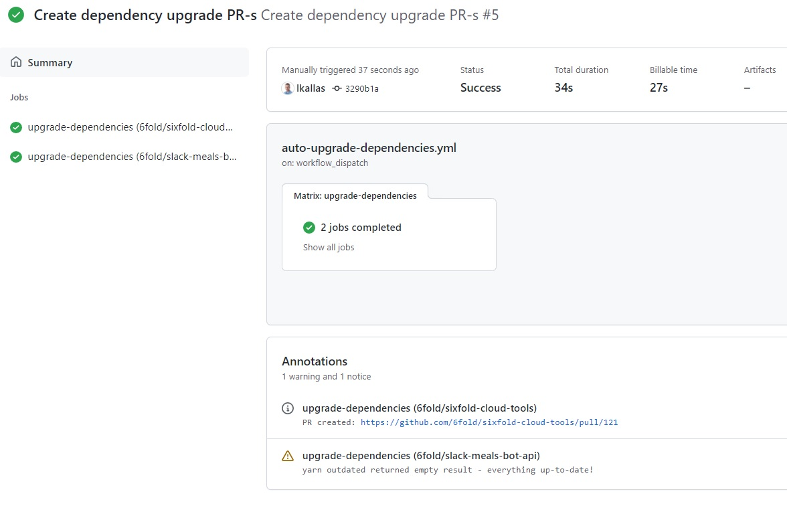

# Automate dependency upgrades with Yarn and Github action

This repository contains a Github action [workflow template](./auto-upgrade-dependencies.yml) that will make upgrading
your project dependencies as easy as clicking a button.  

You can read about Github actions [here](https://docs.github.com/en/actions).

## How does this workflow work?

1. The workflow is initiated by a push of a `Run workflow` button found on actions page.
2. Inputs are provided to the workflow eg. dependency names, repository names.
3. Workflow will upgrade dependencies in each provided repository in an isolated separate (parallel) job.
   1. Job checks out the default branch, usually `main` or `master` but detected automatically.
   2. Job checks if provided branch name is in use upstream, if so error is logged and job does not proceed.
   3. Job checks whether provided dependencies exist in `package.json` file. If none of the provided dependencies are found, job does not proceed.
   4. Job checks if whether dependencies are outdated in `package.json`. If none are outdated, does not proceed.
   5. Job checks out a new feature branch which name is provided by the workflow input.
   6. Job runs `yarn add <dependency names>` to update `package.json` and `yarn.lock` files.
   7. If there are un-committed changes, the job commits with `chore: (auto)upgrade <dependency names>` message and pushes changes to the upstream repository. Does not proceed if change set is empty.
   8. Job creates pull-request if push step was successful. Sets PR title(same as commit message), labels and assigns the user that started the workflow. You can see the PR URL logged as warning in the workflow summary. 

And this is the finished workflow result:  

## Workflow setup

Follow these [simple instructions](https://docs.github.com/en/actions/quickstart) to set up a workflow inside your Github repository.  
Or just click on the `Actions` tab inside your repository and then `New workflow` -> `set up a workflow yourself`.

After which you may copy-paste the [workflow template](./auto-upgrade-dependencies.yml) contents into the online editor for  and commit the changes.

### Workflow secrets

This workflow requires two kind of secrets saved under Github organization or repository*:

> ***NOTE:** Setting secrets require Github admin permissions.

1. `GH_TOKEN` which is a Github's `Personal access token` with `repo` scope defined. You can create your token [in the settings](https://github.com/settings/tokens/new).
2. `NPM_TOKEN` which is a [npmjs](https://www.npmjs.com/) `read-only` access token to access public and private packages inside NPM registry.

### Workflow inputs

The action run prompt will require you to fill in these inputs:

| Name                   | Required | Description                                   | Default value \| Example                |
|------------------------|----------|-----------------------------------------------|-----------------------------------------|
| dependencies-to-update | `true`   | JSON array string with dependencies to update | `["rimraf", "typescript"]`              |
| repositories-to-update | `true`   | JSON array string with repositories to update | `["org/repo-name", "org/another-repo"]` |
| branch-name            | `false`  | Branch from which the PR is made              | `auto_upgrade_dependencies`             |
| labels                 | `false`  | Labels that are attached to pull-request      | `dependencies, actions, bot`            |

## Examples

Here you can find few examples how the workflow behaves:

1. [Bla bla](./)

## Actions billing

GitHub Actions usage is free for both public repositories and self-hosted runners. 
For private repositories, each GitHub account receives a certain amount of free minutes and storage, 
depending on the product used with the account. Any usage beyond the included amounts is controlled by spending limits.

[Read more here](https://docs.github.com/en/billing/managing-billing-for-github-actions/about-billing-for-github-actions)
